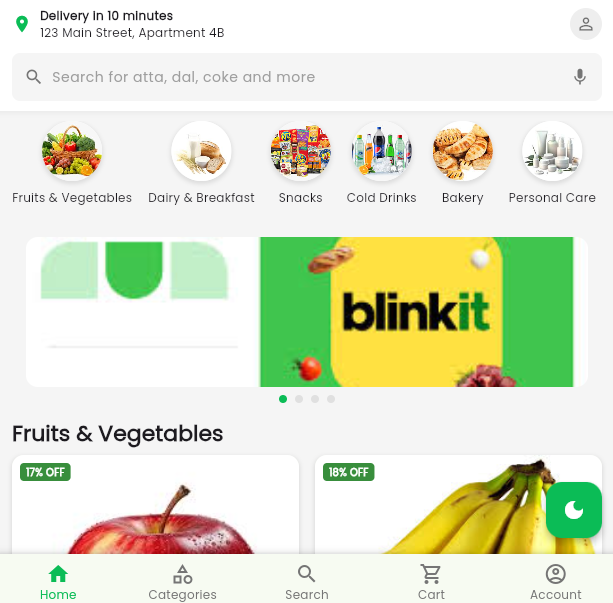
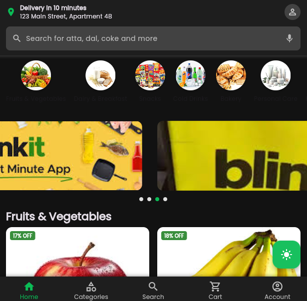
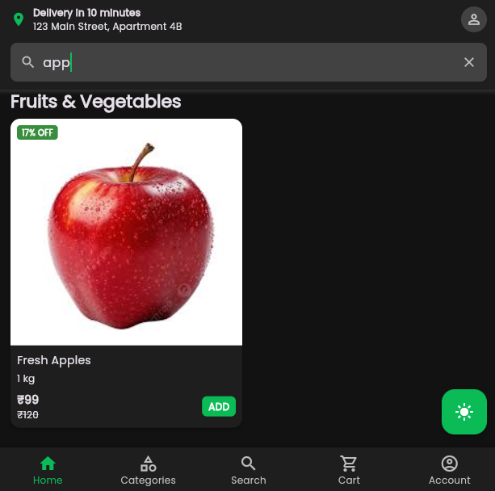
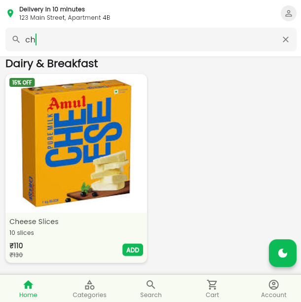

# assignment
## 📱 Screenshots

<div style="display: flex; flex-direction: row;">
  
  
  
  
</div>

## 📂 Project Structure

<pre> ```bash lib/ ├── data/ │ └── dummy_data.dart ├── models/ │ ├── category.dart │ └── product.dart ├── providers/ │ ├── product_provider.dart │ └── theme_provider.dart ├── screens/ │ └── home_screen.dart ├── widgets/ │ ├── bottom_nav_bar.dart │ ├── category_list.dart │ ├── custom_app_bar.dart │ ├── offer_carousel.dart │ └── product_grid.dart └── main.dart ``` </pre>

## 🚀 How to Run

1. Make sure you have Flutter 3.x or above installed
2. Clone the repository
   \`\`\`
   git clone [https://github.com/Vijeta-flutter/assignment]
   \`\`\`
3. Navigate to the project directory
   \`\`\`
   cd blinkit_clone
   \`\`\`
4. Get dependencies
   \`\`\`
   flutter pub get
   \`\`\`
5. Run the app
   \`\`\`
   flutter run
   \`\`\`
